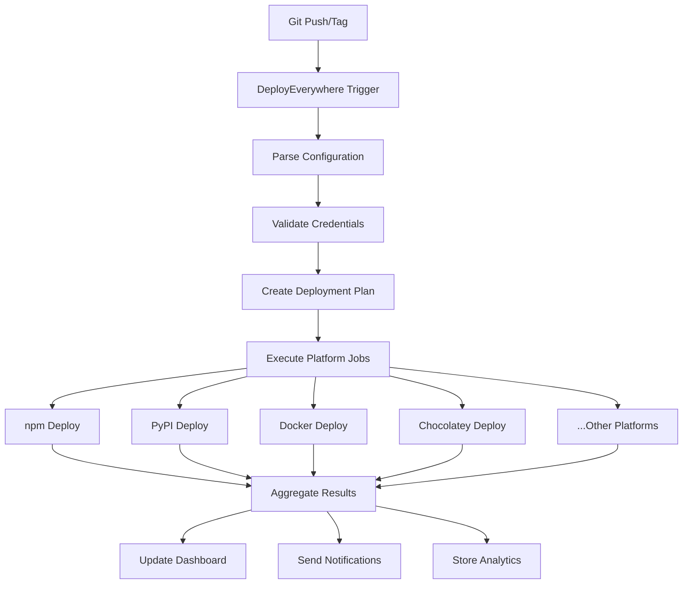

# Deployment Platform Market Analysis & Product Concept

## 🔍 Market Research: Existing Solutions

### **Current Players & Their Limitations**

#### 1. **Release-It** (8.6k ⭐)
- **Focus**: Git + npm primarily, some plugins
- **Limitations**: Limited to npm ecosystem, manual package manager configuration
- **Missing**: Multi-platform package manager automation

#### 2. **Semantic Release** (22.4k ⭐) 
- **Focus**: Automated versioning based on commit conventions
- **Limitations**: Primarily npm/JavaScript ecosystem, complex setup
- **Missing**: Visual deployment dashboard, multi-language support

#### 3. **GoReleaser** (13k+ ⭐)
- **Focus**: Go/Rust/TypeScript/Python cross-platform builds
- **Strengths**: Excellent multi-platform binary builds, many package formats
- **Limitations**: Language-specific, no universal package manager support
- **Missing**: Web dashboard, selective deployment control

#### 4. **Verdaccio** (17.1k ⭐)
- **Focus**: Private npm registry proxy/cache
- **Limitations**: npm-only, not a deployment platform
- **Missing**: Multi-package manager deployment automation

#### 5. **GitHub Actions Marketplace**
- **Focus**: Individual workflow actions
- **Limitations**: Fragmented, requires manual workflow composition
- **Missing**: Unified deployment orchestration platform

### **Market Gap Analysis**

**❌ What's Missing:**
- **Universal Multi-Platform Deployment**: No single tool handles PyPI + npm + Docker + Chocolatey + AUR + Homebrew + Snap + etc.
- **Visual Deployment Dashboard**: All current tools are CLI-only
- **Selective Deployment**: No easy "deploy to these 5 platforms, skip these 3"
- **Deployment Status Monitoring**: No real-time status across all platforms
- **Template Library**: No reusable deployment configurations
- **Rollback Management**: No unified rollback across platforms
- **Cost Optimization**: No deployment cost tracking/optimization

---

## 🚀 Product Concept: "DeployEverywhere"

### **Core Value Proposition**
> "Deploy to every package manager and platform with one command, one dashboard, zero hassle."

### **Target Market Segments**

1. **Solo Developers** ($29/month)
   - Open source maintainers
   - Side project creators
   - Indie developers

2. **Small Teams** ($99/month) 
   - Startups
   - Small software companies
   - Development agencies

3. **Enterprise** ($499/month)
   - Large corporations
   - Multi-product companies
   - Enterprise DevOps teams

### **Key Features & Architecture**

#### 🎯 **Core Features**

##### 1. **Universal Package Manager Support**
```yaml
# deployeverywhere.yml
name: contextlite
version: 1.0.42
platforms:
  npm: enabled
  pypi: enabled  
  chocolatey: enabled
  docker: enabled
  homebrew: enabled
  aur: enabled
  snap: enabled
  crates: enabled
  github: enabled
  vscode: enabled
  # + 20 more platforms
```

##### 2. **Visual Deployment Dashboard**
- Real-time deployment status across all platforms
- Success/failure visualization 
- Deployment history timeline
- Package download statistics aggregation
- Cost tracking per platform

##### 3. **Smart Deployment Orchestration**
- Dependency-aware deployment order
- Automatic retry logic with exponential backoff
- Parallel vs sequential deployment strategies
- Platform-specific optimization

##### 4. **Template Library & Marketplace**
```yaml
# Use community templates
template: javascript-library-full-stack
# Or create custom deployments
platforms:
  npm: 
    registry: npmjs.org
    access: public
  pypi:
    registry: pypi.org
    wheel: true
```

##### 5. **Selective Deployment Control**
- "Deploy to production platforms only"
- "Test deployment on staging platforms"
- "Skip existing versions automatically"
- "Deploy only to platforms with changes"

##### 6. **Deployment Analytics & Insights**
- Download metrics across all platforms
- Platform performance comparison
- User geographic distribution
- Cost per download analysis

#### 🏗️ **Technical Architecture**

##### **Frontend (Dashboard)**
- **Next.js/React** - Modern web dashboard
- **Real-time updates** - WebSocket deployment status
- **Mobile responsive** - Deploy from anywhere
- **Dark/light themes** - Developer-friendly UI

##### **Backend (Orchestration Engine)**
- **Node.js/TypeScript** - Primary API server
- **Go workers** - High-performance deployment agents
- **Redis** - Job queuing and caching
- **PostgreSQL** - Deployment history and analytics
- **Kubernetes** - Scalable deployment infrastructure

##### **Integration Layer**
- **GitHub Actions integration** - Native CI/CD workflow
- **API-first design** - CLI, dashboard, and programmatic access
- **Webhook system** - Real-time status updates
- **Plugin architecture** - Custom platform support

##### **Security & Authentication**
- **OAuth2** - GitHub, GitLab, Azure DevOps integration
- **API key management** - Secure platform credentials
- **Audit logging** - Complete deployment history
- **Role-based access** - Team permission management

#### 📊 **Deployment Flow Architecture**



#### 🎨 **User Experience Design**

##### **Dashboard Views**

1. **Overview Dashboard**
   - Deployment status grid (all platforms)
   - Recent activity timeline
   - Download statistics summary
   - Quick deployment buttons

2. **Platform Management**
   - Configure each platform individually
   - Test platform connections
   - View platform-specific metrics
   - Manage API keys/credentials

3. **Deployment History**
   - Filterable deployment log
   - Detailed error messages
   - Performance metrics
   - Rollback options

4. **Analytics & Insights**
   - Cross-platform download charts
   - Geographic user distribution
   - Platform performance comparison
   - Cost optimization recommendations

##### **CLI Experience**
```bash
# Install CLI
npm install -g deployeverywhere

# Initialize project
deployeverywhere init

# Deploy to all configured platforms
deployeverywhere deploy

# Deploy to specific platforms
deployeverywhere deploy --platforms npm,pypi,docker

# Check deployment status
deployeverywhere status

# Rollback deployment
deployeverywhere rollback --version 1.0.41
```

#### 🔌 **Platform Integrations**

##### **Package Managers (20+ supported)**
- **npm** - Node.js packages
- **PyPI** - Python packages  
- **Crates.io** - Rust crates
- **RubyGems** - Ruby gems
- **Maven Central** - Java/Kotlin
- **NuGet** - .NET packages
- **Packagist** - PHP packages
- **Go Modules** - Go packages

##### **System Package Managers**
- **Homebrew** - macOS packages
- **Chocolatey** - Windows packages
- **Snap** - Linux universal packages
- **AUR** - Arch Linux packages
- **APT** - Debian/Ubuntu packages
- **RPM** - Red Hat/SUSE packages
- **Winget** - Windows Package Manager
- **Scoop** - Windows CLI installer

##### **Container Registries**
- **Docker Hub** - Public container images
- **GitHub Container Registry** - GitHub-integrated containers
- **Amazon ECR** - AWS container registry
- **Google Container Registry** - GCP containers
- **Azure Container Registry** - Azure containers

##### **Development Platforms**
- **VS Code Marketplace** - Editor extensions
- **JetBrains Plugin Repository** - IDE plugins
- **Chrome Web Store** - Browser extensions
- **Firefox Add-ons** - Browser extensions
- **WordPress Plugin Directory** - WordPress plugins

#### 💰 **Pricing Strategy**

##### **Free Tier** (GitHub integration)
- 1 project
- 5 platforms
- 10 deployments/month
- Community support

##### **Pro Tier** ($29/month)
- 10 projects  
- All platforms
- Unlimited deployments
- Email support
- Deployment analytics

##### **Team Tier** ($99/month)
- 50 projects
- Team collaboration
- Role-based access
- Priority support
- Advanced analytics
- Custom templates

##### **Enterprise Tier** ($499/month)
- Unlimited projects
- On-premise deployment
- SSO integration
- SLA guarantees  
- Custom integrations
- Dedicated support

#### 🎯 **Go-to-Market Strategy**

##### **Phase 1: MVP (3 months)**
- Core 8 package managers (npm, PyPI, Docker, etc.)
- Basic dashboard
- GitHub Actions integration
- CLI tool
- Free tier launch

##### **Phase 2: Growth (6 months)**
- 20+ package managers
- Advanced analytics
- Team collaboration features
- VS Code extension
- Pro tier launch

##### **Phase 3: Scale (12 months)**
- Enterprise features
- Custom platform plugins
- Advanced security
- Multi-region deployment
- Enterprise tier launch

##### **Marketing Channels**
- **Developer Communities**: Reddit, HackerNews, Dev.to
- **Content Marketing**: Technical blog posts, tutorials
- **Integration Partnerships**: GitHub, GitLab, Azure DevOps
- **Conference Sponsorships**: DevOps/Developer conferences
- **Influencer Partnerships**: OSS maintainers, DevRel

#### 📈 **Business Model Validation**

##### **Market Size Estimation**
- **TAM**: 27M+ developers worldwide
- **SAM**: 5M+ developers deploying packages
- **SOM**: 100k+ developers managing multi-platform deployments

##### **Revenue Projections (Year 1)**
- **Free users**: 10,000 (0% revenue)
- **Pro users**: 1,000 × $29 = $29k/month
- **Team users**: 100 × $99 = $9.9k/month  
- **Enterprise**: 10 × $499 = $4.99k/month
- **Total MRR**: $43.89k ($526k ARR)

##### **Key Success Metrics**
- **Platform Coverage**: Support 25+ deployment platforms
- **User Adoption**: 10k+ active projects
- **Deployment Success Rate**: >95% success rate
- **Time Savings**: Average 80% deployment time reduction
- **Customer Satisfaction**: NPS >50

---

## 🚧 **Implementation Roadmap**

### **Phase 1: Core Platform (Months 1-3)**

#### **Month 1: Foundation**
- [ ] Project setup and architecture
- [ ] Basic dashboard UI/UX design
- [ ] Authentication system (GitHub OAuth)
- [ ] Database schema design
- [ ] API framework setup

#### **Month 2: Core Integrations**
- [ ] npm deployment integration
- [ ] PyPI deployment integration  
- [ ] Docker Hub integration
- [ ] GitHub Releases integration
- [ ] Basic deployment orchestration

#### **Month 3: Dashboard & CLI**
- [ ] Deployment status dashboard
- [ ] CLI tool development
- [ ] GitHub Actions integration
- [ ] Basic error handling & retries
- [ ] Initial user testing

### **Phase 2: Platform Expansion (Months 4-6)**

#### **Month 4: Package Managers**
- [ ] Chocolatey integration
- [ ] Homebrew integration
- [ ] Crates.io integration
- [ ] Snap Store integration

#### **Month 5: Analytics & Teams**
- [ ] Deployment analytics
- [ ] Team collaboration features
- [ ] Role-based access control
- [ ] Advanced dashboard features

#### **Month 6: Polish & Scale**
- [ ] Performance optimization
- [ ] Advanced error handling
- [ ] Documentation & tutorials
- [ ] Security audit & improvements

### **Phase 3: Enterprise & Growth (Months 7-12)**

#### **Months 7-9: Enterprise Features**
- [ ] Enterprise authentication (SSO)
- [ ] On-premise deployment options
- [ ] Advanced security features
- [ ] Custom platform plugins
- [ ] API rate limiting & quotas

#### **Months 10-12: Scale & Optimize**
- [ ] Multi-region deployment
- [ ] Performance monitoring
- [ ] Cost optimization features
- [ ] Advanced analytics
- [ ] Mobile app (optional)

---

## 🎯 **Competitive Advantages**

### **1. Breadth of Platform Support**
- Most comprehensive package manager coverage
- Single unified interface for all deployments
- Consistent experience across platforms

### **2. Visual Deployment Management**
- First deployment platform with modern dashboard
- Real-time status monitoring
- Visual deployment history and analytics

### **3. Intelligent Orchestration**
- Smart deployment ordering based on dependencies
- Automatic retry logic and error recovery
- Platform-specific optimization strategies

### **4. Developer Experience Focus**
- Zero-config deployment for common scenarios
- Extensive template library
- CLI + Dashboard + API for all workflows

### **5. Enterprise-Ready Architecture**
- Scalable cloud infrastructure
- Security-first design
- Team collaboration built-in

---

## 📋 **Next Steps**

### **Immediate Actions (This Week)**
1. **Validate Market Demand**: Survey 100+ developers about multi-platform deployment pain points
2. **Technical Prototype**: Build MVP with npm + PyPI + Docker integration
3. **UI/UX Mockups**: Create dashboard wireframes and user flow designs
4. **Competitive Analysis**: Deep dive into GoReleaser, Release-It limitations
5. **Architecture Planning**: Detailed technical architecture document

### **Short-term Goals (Next Month)**
1. **MVP Development**: Working deployment to 5 platforms
2. **Landing Page**: Professional marketing site with waitlist
3. **Community Engagement**: Share concept in developer communities
4. **Potential Partnerships**: Reach out to GitHub, GitLab for integration discussions
5. **Funding Strategy**: Determine bootstrap vs. venture funding approach

### **Success Criteria for MVP**
- Deploy single project to 5+ platforms in <5 minutes
- 95%+ deployment success rate
- Dashboard shows real-time status
- CLI tool works reliably
- 100+ developers sign up for beta access

---

**Bottom Line**: The market has fragmented solutions that each solve part of the deployment problem. There's a clear opportunity for a unified platform that abstracts away the complexity of multi-platform deployment while providing professional-grade tooling and insights. Your ContextLite deployment experience proves the value - now it's about productizing that capability for the broader developer community.
